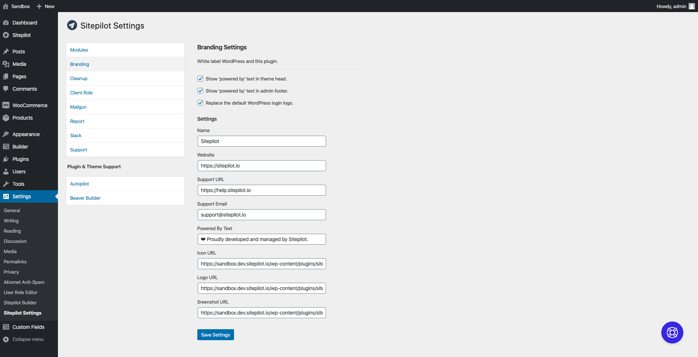

# Sitepilot

> A WordPress plugin for managing and developing websites. You can use this plugin to speed up development and to give your clients a better (branded) WordPress experience.

_Please note: Sitepilot is currently under active development and will be released early 2020._

[🚀 Download the latest version of Sitepilot here.](https://github.com/sitepilot/sitepilot/releases)




## Usage

Sitepilot provides several modules for managing and developing WordPress websites for clients. All functionalities are disabled by default but can be enabled through a settings page in the WordPress admin dashboard.

## Modules

### Branding

White label WordPress and this plugin.

- Show 'powered by' text in theme head.
- Show 'powered by' text in admin footer.
- Replace the default WordPress login logo.

### Cleanup

Cleanup the WordPress admin interface.

- Deactivate WordPress logo in the admin bar.
- Deactivate default WordPress dashboard widgets.

### Client Role

Setup a custom client role and select capabilities.

### Menu

Register an admin menu with server information and WordPress statistics.

### Support

Functionalities for supporting clients.

- Log in as administrator using a Slack webhook by clicking the WordPress logo on the login page.
- Insert a comma separated list of IPs which are allowed to login using the Slack login feature.
- Insert a (support) script which will be injected into the admin footer (for example the [Helpscout Beacon](https://docs.helpscout.com/article/1250-beacon-jumpstart-guide) script).

### User Switching

Allow administrators (and users with the 'sp_user_switching' capability) to impersonate a user.

## Plugin & Theme Support

Sitepilot is compatible with some plugins / themes to control the branding and functionality of them.

### Astra

Support settings for the Astra theme.

- White label theme and Pro addon.

### Beaver Builder

Support settings for the Beaver Builder plugin, theme and add-ons.

- White label builder plugin.
- White label builder theme (if installed).
- White label Power Pack plugin (if installed).
- White label Ultimate Addons plugin (if installed).
- Deactivate all default builder modules.
- Deactivate all default builder templates.
- Change the admin settings capability of the builder.

## Update

The plugin is updated using a [plugin update checker](https://github.com/YahnisElsts/plugin-update-checker). It is possible to register your plugin / theme to the internal updater using filters. The updater is checking a custom [update server](https://github.com/YahnisElsts/wp-update-server) for updates.

### Update Server URL

```php
/**
 * Change the update server URL.
 *
 * @return string $url
 */
function sp_filter_update_server_url()
{
    return 'https://update.sitepilot.io/public/v1';
}

add_filter('sp_update_server_url', 'sp_filter_update_server_url');
```

### Theme Updater

```php
/**
 * Register theme to the updater.
 *
 * @param array $themes
 * @return array $themes
 */
function sp_filter_update_themes(array $themes)
{
    $theme = [];
    $theme['file'] = trailingslashit(get_stylesheet_directory()) . 'functions.php';
    $theme['slug'] = get_option('stylesheet');

    array_push($themes, $theme);
    return $themes;
}

add_filter('sp_update_themes', 'sp_filter_update_themes');
```

### Plugin Updater

```php
/**
 * Register plugin to the updater.
 *
 * @param array $plugins
 * @return array $plugins
 */
function sp_filter_update_plugins(array $plugins)
{
    $plugin = [];
    $plugin['file'] = __FILE__;
    $plugin['slug'] = '<plugin-slug>';

    array_push($plugins, $plugin);
    return $plugins;
}

add_filter('sp_update_plugins', 'sp_filter_update_plugins');
```
